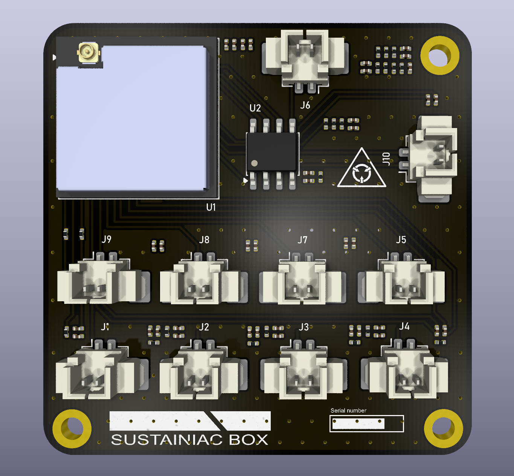
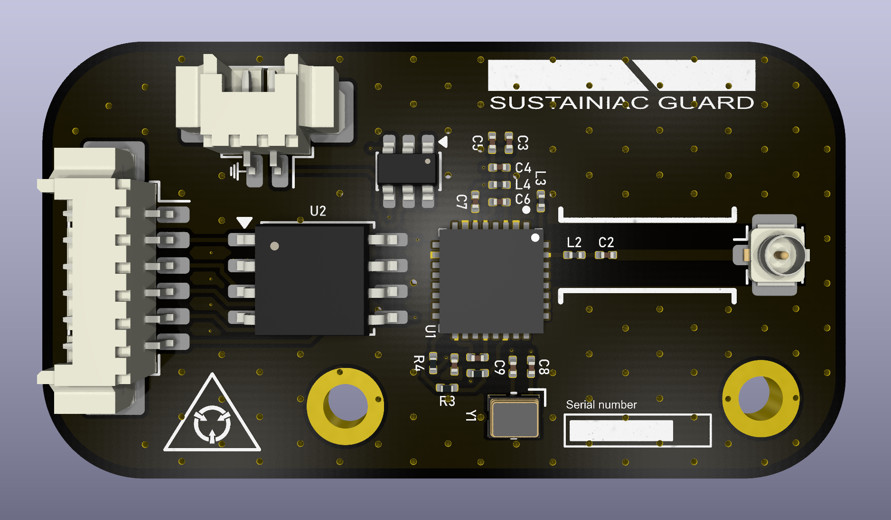
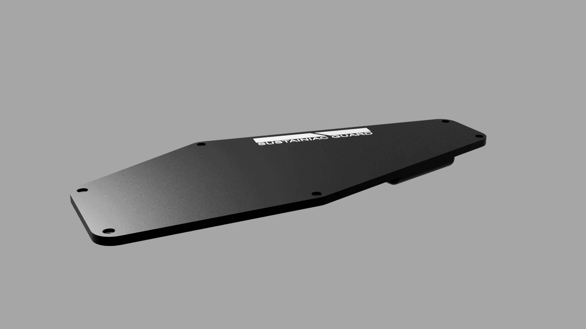

# Sustainiac Wireless Mode Controller

A wireless control system for switching modes on a Sustainiac humbucker pickup using two Arduino-based units communicating via **OOK / ASK RF transmission**.

---

## Motivation

This project was driven by a practical constraint: I wanted to install a Sustainiac system in a guitar with significant sentimental value, but I did not want to permanently modify the instrument by drilling additional holes for control switches.

To avoid altering the guitar body, I designed a fully wireless control solution using a dedicated transmitter and receiver architecture.

The system consists of:
- A **transmitter unit** housed in a custom enclosure mounted on a pedalboard, powered from a 12V supply.
- A **receiver unit** integrated into a redesigned guitar back plate, powered by the guitar’s internal battery.

This approach enables full external control of Sustainiac modes, eliminating the need for additional physical switches on the instrument.

The receiver interfaces directly with the Sustainiac control lines and selects operating modes based on commands received from the transmitter.

This project demonstrates:
- Embedded systems design
- RF communication (OOK / ASK)
- Hardware/software integration
- Practical mechanical and enclosure design under real-world constraints

---

## System Overview

The project consists of:

- **TX Unit (Transmitter)** – Sends wireless commands to select Sustainiac modes
- **RX Unit (Receiver)** – Receives commands and switches Sustainiac control lines accordingly

---

## System Context

This project interfaces with a Sustainiac pickup system, which provides multiple feedback-based operating modes (sustain, harmonic, blend).

The underlying behaviour of these modes is demonstrated here:

https://www.youtube.com/watch?v=g7U48UkLwyM

---

## Operation

The transmitter generates encoded **OOK (On-Off Keying) / ASK (Amplitude Shift Keying)** pulse signals using a low-cost RF module.

The receiver measures incoming pulse timings and decodes them into discrete mode commands.

These commands drive MOSFET-controlled outputs connected to the Sustainiac system, enabling real-time mode switching.

---

## Supported Modes

| Mode | Function |
|------|----------|
| Passive | Pickup operates normally |
| Sustain | Fundamental sustain mode |
| Blend | Mixed sustain mode |
| Harmonic | Harmonic feedback mode |

---

## PCB Design

### Transmitter PCB

#### PCB Design Specifications

- Powered from a 12V pedalboard supply
- Designed for compact integration within a pedalboard-mounted enclosure
- Enclosure mechanically reinforced for foot-switch environment and live use durability
- Short-range OOK/ASK RF link optimised for reliable command transmission between transmitter and receiver units
- System implements a **failsafe Passive mode** on signal loss, power-down, or invalid transmission state

#### Design considerations
- Mechanical robustness for stage/pedalboard use
- Stable operation from shared 12V power environment
- Deterministic fallback behaviour (Passive mode default state)
- Reliable short-range RF command delivery with minimal latency

---

### Receiver PCB

#### PCB Design Specifications

- Highly constrained power budget due to Sustainiac system current consumption
- Designed around a low-power microcontroller (e.g. ATtiny85) with OOK/ASK RF receiver module
- Integrated within guitar cavity/backplate with battery-powered operation

#### Power optimisation strategy

- Deep-sleep modes used during idle periods
- Interrupt-driven wake on RF signal detection
- Minimal active duty cycle for decoding and mode switching
- Efficient MOSFET gate control to reduce switching losses
- System prioritises battery life preservation alongside real-time responsiveness

#### Design considerations
- Coexistence with high-current Sustainiac electronics
- Strict power efficiency requirements for battery-powered operation
- Reliable wake-up from RF events with minimal false triggers
- Robust operation in electrically noisy guitar environment

---

## Hardware Render

### Sustainiac Guard

### Sustainiac Box
